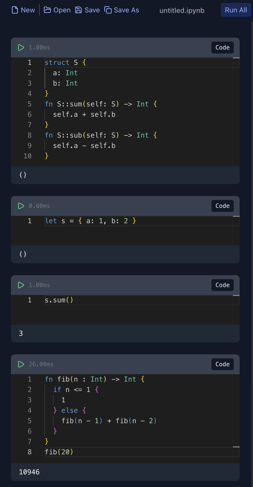

# MoonBit Notebook (Unofficial)

一个基于 Web 的交互式 MoonBit 编程环境，类似于 Jupyter Notebook，让你可以在浏览器中编写、执行和分享 MoonBit 代码。



## ✨ 特性

- 🚀 **交互式编程**: 支持代码和 Markdown 混合编辑
- ⚡ **实时执行**: 即时运行 MoonBit 代码并查看结果
- 📝 **富文本支持**: Markdown 渲染，支持文档和代码混排
- 💾 **文件管理**: 保存和加载 notebook 文件
- 🎨 **现代 UI**: 基于 Radix UI 的美观界面
- 🔧 **代码编辑**: Monaco Editor 提供专业的代码编辑体验
- 📊 **执行状态**: 实时显示代码执行状态和时间
- 🎯 **快捷操作**: 支持键盘快捷键和批量执行

## 🛠️ 技术栈

- **前端框架**: React 19 + TypeScript
- **构建工具**: Vite
- **UI 组件**: Radix UI + UnoCSS
- **代码编辑**: Monaco Editor
- **状态管理**: Zustand
- **MoonBit 解释器**: 内置 MoonBit Eval 解释器

## 🚀 快速开始

### 环境要求

- Node.js >= 18
- pnpm (推荐) 或 npm

### 安装

```bash
# 克隆项目
git clone https://github.com/oboard/moonbit-notebook.git
cd moonbit-notebook

# 安装依赖
pnpm install
# 或者
npm install
```

### 开发

```bash
# 启动开发服务器
pnpm dev
# 或者
npm run dev
```

访问 http://localhost:5173 开始使用。

### 构建

```bash
# 构建生产版本
pnpm build
# 或者
npm run build
```

## 📖 使用指南

### 基本操作

1. **创建 Cell**: 点击 `+` 按钮添加代码或 Markdown cell
2. **执行代码**: 点击 ▶️ 按钮或使用 `Ctrl/Cmd + Enter`
3. **编辑模式**: 点击 cell 进入编辑模式
4. **切换类型**: 使用右上角的类型标签切换 Code/Markdown

### 快捷键

- `Ctrl/Cmd + Enter`: 执行当前 cell
- `Shift + Enter`: 执行当前 cell 并创建新 cell
- `Ctrl/Cmd + S`: 保存 notebook
- `Ctrl/Cmd + O`: 打开 notebook

### 文件操作

- **新建**: 创建空白 notebook
- **打开**: 加载本地 `.ipynb` 文件
- **保存**: 保存当前 notebook
- **另存为**: 导出为新文件

## 🎯 功能特性

### Code Cell
- 支持完整的 MoonBit 语法
- 实时语法高亮
- 错误提示和调试信息
- 执行时间统计
- 输出结果展示

### Markdown Cell
- 标准 Markdown 语法支持
- 实时预览
- 代码块语法高亮
- 数学公式支持（计划中）

### 执行管理
- 单个 cell 执行
- 全部执行功能
- 执行状态指示
- 停止执行功能

## 🔧 开发说明

### 项目结构

```
src/
├── components/          # React 组件
│   ├── Cell.tsx        # Cell 组件
│   ├── Notebook.tsx    # Notebook 容器
│   └── Toolbar.tsx     # 工具栏
├── stores/             # 状态管理
│   └── notebook.ts     # Notebook 状态
├── types/              # TypeScript 类型定义
│   └── notebook.ts     # Notebook 相关类型
├── services/           # 服务层
│   └── fileService.ts  # 文件操作服务
├── interpreter/        # MoonBit 解释器
└── utils/              # 工具函数
```

### 核心组件

- **App.tsx**: 主应用组件，处理全局状态和事件
- **Notebook.tsx**: Notebook 容器，管理 cell 列表
- **Cell.tsx**: 单个 cell 组件，支持代码和 Markdown
- **Toolbar.tsx**: 工具栏，提供文件操作和执行控制

## 🤝 贡献

欢迎提交 Issue 和 Pull Request！

### 开发流程

1. Fork 项目
2. 创建功能分支: `git checkout -b feature/amazing-feature`
3. 提交更改: `git commit -m 'Add amazing feature'`
4. 推送分支: `git push origin feature/amazing-feature`
5. 提交 Pull Request

### 代码规范

- 使用 TypeScript
- 遵循 ESLint 规则
- 使用 Prettier 格式化代码
- 编写清晰的提交信息

## 🙏 致谢

- [MoonBit](https://www.moonbitlang.com/) - 优秀的编程语言
- [Monaco Editor](https://microsoft.github.io/monaco-editor/) - 强大的代码编辑器
- [Radix UI](https://www.radix-ui.com/) - 优秀的 UI 组件库
- [Jupyter](https://jupyter.org/) - Notebook 概念的灵感来源

## 📞 联系

- 作者: oboard
- 邮箱: oboard@outlook.com

---

**注意**: 这是一个非官方项目，与 MoonBit 官方团队无关。
